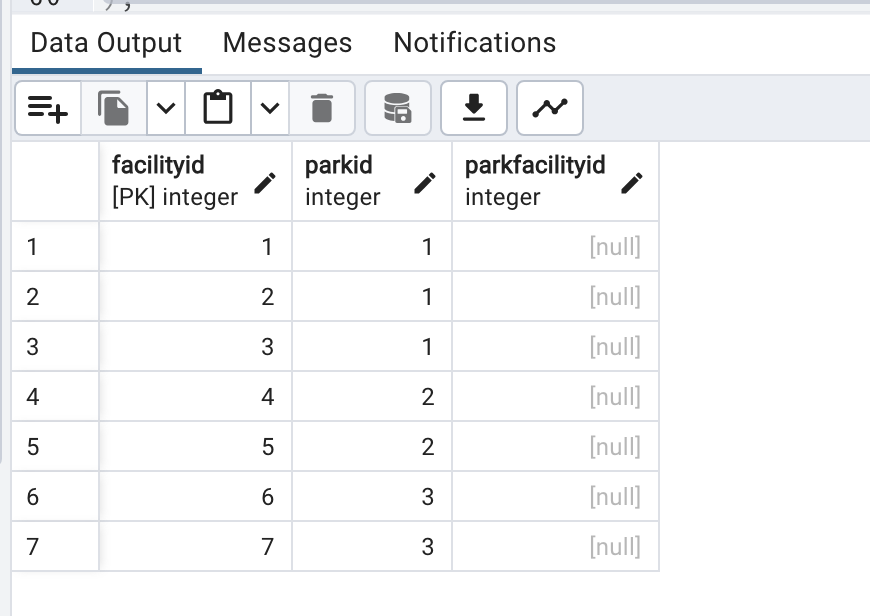

#normalization report  
  
##Part 1: Normalizing to 1NF  
Process: 1. start by creating a table Parks_Info to store park
information, including park names and associated facilities.  
2. insert the data into the Parks_Info table.  
3. identify repeating groups (facilities) within the Parks_Info table
and split them into separate tables (Parks and Facilities) to eliminate
redundancy.  
4. create a Parks table to store unique park names.  
5. create a Facilities table to store unique facilities, linked to parks
through a foreign key.  
6. populate the Parks table with unique park names and the Facilities
table with facility information, associating each facility with its
corresponding park.  
Rationale:the process eliminate redundancy and improve data integrity by
organizing data into separate tables and ensuring each table represents
a single entity (park or facility), each table has a primary key and
that data is atomic.  
1NF normalization involves ensuring that each field in the "Parks_Info" table
contains only atomic values. Initially, the "Facility" column contains multiple 
facilities in one row, violating 1NF, a rule that requires each field to have 
only a single value. To solve this problem, we decomposed the "facilities" data,
splitting the list into individual records. This step means creating additional 
records in a new "Facilities" table, where each facility is associated with a park
by "ParkID". This design removes multi-valued attributes from the "Parks_Info" table
and ensures that each entry in the column is atomic, meeting the requirements of 1NF.
##Part 2: 2NF  
Process: 1. Create Related Tables, create a ParkFacilities table to
store unique facility names.  
2. add a new column ParkFacilityID to the Facilities table to reference
ParkFacilities.  
3. create a foreign key constraint between Facilities and ParkFacilities
to ensure referential integrity.  
4. update the Facilities table to set ParkFacilityID based on the
corresponding FacilityID from ParkFacilities.  
5. remove redundant columns,FacilityName from the Facilities table.  
To achieve 2NF, we split the data into two tables: "Parks" and "Facilities".
By separating the facility names into a separate table ParkFacilities
and referencing them in the Facilities table, remove partial
dependencies and ensure that each non-key attribute is fully
functionally dependent on the primary key, hereby satisfying the requirements of 2NF
##challenges and solutions
During the normalization process, one of the main challenges was to break
down the facilities areas in a way that preserved the connection between the
park and its facilities. This is further complicated by the need to maintain
data integrity when split into separate tables.The solution involves creating
a powerful SQL script to handle the extraction and insertion of data. 
Additionally, implementing foreign keys requires a thorough understanding
of the relationships between tables.
  
  
  
  

